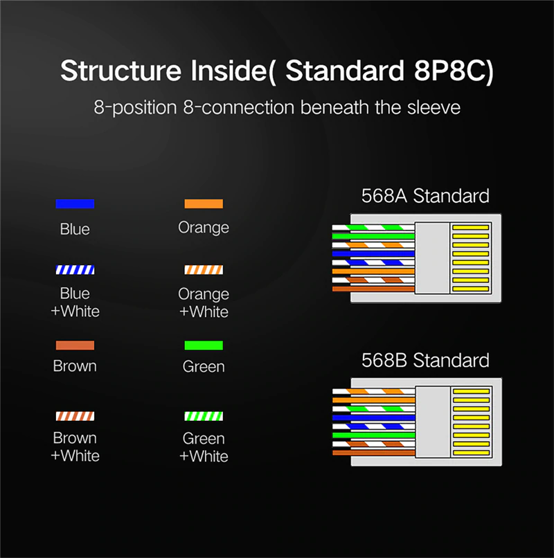
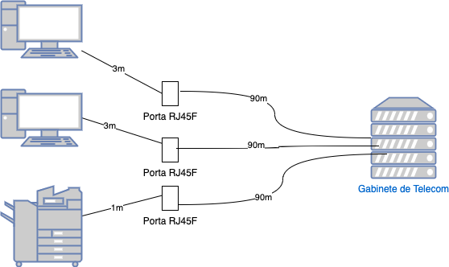

# Orientações importantes sobre a crimpagem de cabos de rede ethernet

Os cabos de rede são componentes modulares, não é utilizada solda para ligar os conectores aos cabos. Todo contato elétrico é realizado por meio de prensa com o auxílio de um alicate específico em um processo chamado de crimpagem.

Deve-se evitar ao máximo o uso de emendas intermediárias, pois essas se tornam um possível ponto de falha com o passar dos anos seja pela oxidação dos contatos ou mal contato devido ao cabo não estar devidamente conectado.

Quando for necessário utilizar emendas essas podem ser feitas utilizando um conector RJ-45 fêmea. Não se deve tentar realizar emendas descascando o cabo da mesma maneira como são feitas emendas de fios elétricos.

## Sequência de cores para crimpar de cabos de rede ethernet

Para uso em redes de computadores, na prática o cabeamento irá funcionar com qualquer sequência de cores, desde que respeitada a mesma sequência na outra ponta. Porém existem duas padronizações principais EIA/TIA 568A e 568B, é recomendado seguir o padrão a fim de facilitar manutenções.

A figura abaixo apresenta a sequência de cores nos dois padrões.

### Comprimento mínimo do cabo

É necessário respeitar a distância mínima de 0,5m para evitar que o sinal seja demasiadamente elevado a ponto de indicar uma colisão de pacotes pelo mecanismo de deteção de colisões CSMA/CD.

### Comprimento máximo do cabo

O comprimento máximo do cabo entre dois dispositivos, incluindo todos os patch-cords e quaisquer emendas num caminho entre as duas pontas, deve somar no máximo de 100m.

Exemplo: ao se utilizar um patch-cord de 1m em cada lado o comprimento do cabo intermediário deveria ser no máximo de 98m.

Em ambientes de cabeamento estruturado adota-se como padrão que o comprimento máximo até um patch-panel seja de até 90m para deixar margem para uso de algum patch-cord na conexão.

No caso onde a distância dos equipamentos total seja superior a 100m, recomenda-se dividir esse segmento com o uso de algum equipamento intermediário - tal como um repetidor ou switch - a fim de que cada segmento não ultrapasse a distância máxima dos 100m.

## Cabo crossover

Em algumas situações é necessário assumir configuração cruzada (crossover), esse tipo de ligação é utilizado principalmente para conexão direta entre a placa de rede de duas máquinas sem o auxílio de um switch, assim como também no caso de cascateamento de equipamentos mais antigos que não possuam porta de uplink.

### Sequência de cores para montagem de um cabo crossover

| Sinal | # Pino  | Lado 1 (568B)  | Lado 2         |
| ----- | ------- | -------------- | -------------- |
| TD+   | 1       | Laranja/branco | Verde/branco   |
| TD-   | 2       | Laranja        | Verde          |
| RX+   | 3       | Verde/branco   | Laranja/branco |
| BD1+  | 4       | Azul           | Marrom/branco  |
| BD1-  | 5       | Azul/branco    | Marrom         |
| RX-   | 6       | Verde          | Laranja        |
| BD2+  | 7       | Marrom/branco  | Azul           |
| BD2-  | 8       | Marrom         | Azul/branco    |

### Mapa de pinagem de um cabo crossover

Considerando o número do conector/pino de um cabo a montagem de um cabo crossover é realizada conectando as seguintes vias:

| Ponta 1 | Ponta 2 |
| ------- | ------- |
| 8       | 5       |
| 7       | 4       |
| 6       | 2       |
| 5       | 8       |
| 4       | 7       |
| 3       | 1       |
| 2       | 6       |
| 1       | 3       |
