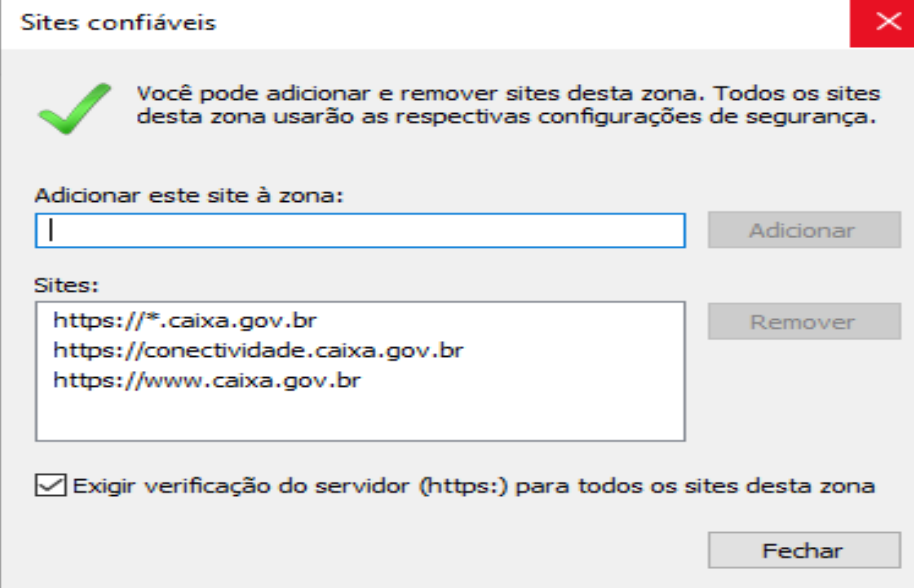

# Configurando o Kaspersky antivírus para obter atualizações através da rede local

## Objetivo:

Este artigo é voltado para ambientes com múltiplos computadores em rede, onde se possui instalado um [agente de atualização do Kaspersky](https://support.kaspersky.com/updater3#downloads) realizando regularmente o download das atualizações do Kaspersky antivírus.

O objetivo desse tipo de cenário é economia de dados de internet bem como proporcionar que os computadores sejam atualizados mais rapidamente uma vez que eles realizarão as cópias dos arquivos diretamente da rede local em vez da internet.

## Configuração nos computadores onde o Kaspersky antivírus está instalado

Abra o Kaspersky antivírus através do ícone na área de trabalho, menu iniciar ou próximo do relógio do sistema.

.png>)

.png>)

.png>)

.png>)

O caminho das atualizações é a pasta local ou da rede onde o seu atualizador está realizando o download das novas definições de vírus. _**Consulte o seu administrador de rede para saber o que deve ser preenchido neste campo**_.

Esse caminho pode ser uma pasta local (ex.: **`c:\temp\antivirus`**) ou um compartilhamento de rede (ex.: **`\\192.168.0.4\antivirus`**).

.png>)

Recomendamos que a primeira posição seja sempre o caminho local.

## Desativando o servidor de atualizações do Kaspersky Lab

Também é possível desativar o uso do servidor de atualização do Kaspersky Lab, de modo que o computador apenas busque as atualizações na rede local. Para isso, siga o procedimento:

Clique com o **botão direito** do mouse na palavra **Ativo** ao lado de **Servidores de atualização da Kaspersky Lab**, no menu que surgir escolha a opção **Desativar**.

.png>)

Após desativar, verifique se a opção mudou de ativo para **Inativo**.

.png>)

## Realizando a atualização do Kaspersky antivírus

Volte para a tela inicial e clique no botão **Atualização do banco de dados**.

.png>)

.png>)

## Artigo relacionado


[criando-um-servidor-interno-de-atualizacao-do-kaspersky-antivirus-no-linux.md](criando-um-servidor-interno-de-atualizacao-do-kaspersky-antivirus-no-linux.md)

