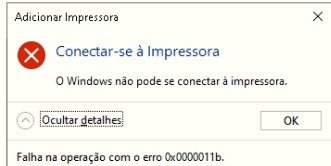

# Reparando o compartilhamento de impressoras do Windows 10

## Descrição do problema

Após alguma atualização automática do Windows não é possível conectar-se a uma impressora compartilhada em outro computador na rede, sendo exibida a mensagem abaixo.



## Solução

Necessário incluir uma chave no registro do windows, no caminho: `HKEY_LOCAL_MACHINE\SYSTEM\CurrentControlSet\Control\Print` incluir uma chave do tipo _Valor DWORD (32 bits)_ com o conteúdo do valor `0`.

A chave de registro deve ser adicionada em todos os computadores, tanto no cliente quanto no servidor onde está compartilhada a impressora. Após o procedimento é necessário reiniciar todos os computadores envolvidos.

Recomenda-se também verificar se todos os computadores estão com todas as atualizações do windows instaladas.

### Arquivo de registro para correção automática

#### Conteúdo do arquivo

```
Windows Registry Editor Version 5.00

[HKEY_LOCAL_MACHINE\SYSTEM\CurrentControlSet\Control\Print]
"RpcAuthnLevelPrivacyEnabled"=dword:00000000
```

#### Download do arquivo





<table data-card-size="large" data-view="cards"><thead><tr><th data-type="users" data-multiple></th><th></th><th></th><th data-hidden data-card-cover data-type="files"></th><th data-hidden data-card-target data-type="content-ref"></th></tr></thead><tbody><tr><td></td><td><p><strong>Renato Monteiro Batista</strong></p><p>Engenheiro de Computação</p></td><td></td><td><a href="../../.gitbook/assets/renato-monteiro-batista.jpeg">renato-monteiro-batista.jpeg</a></td><td><a href="http://renato.ovh">http://renato.ovh</a></td></tr><tr><td></td><td><em>Envie um pix</em></td><td>Se esse artigo te ajudou, colabore com nosso site enviando um pix.</td><td><a href="../../.gitbook/assets/qr-pix-largo.png">qr-pix-largo.png</a></td><td><a href="../../colabore-com-nosso-site.md">colabore-com-nosso-site.md</a></td></tr></tbody></table>

